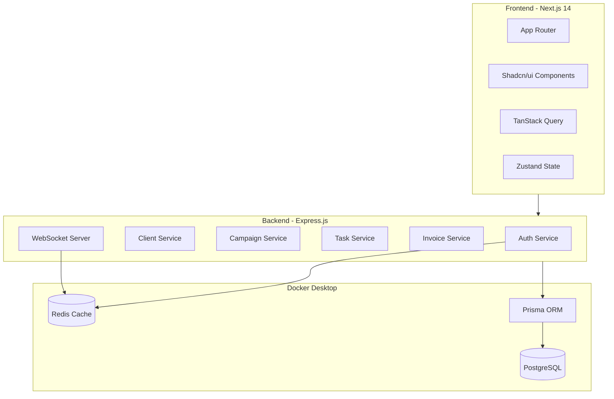

# Enterprise CRM System - Full Implementation Plan

## Architecture Overview



---

## Phase 1: Project Setup and Database (Section 1)

### 1.1 Initialize Full-Stack Project Structure

Create the following directory structure:

```javascript
alphas-client-managemen/
├── app/                    # Next.js App Router pages
├── components/             # React components
├── lib/                    # Shared utilities
├── hooks/                  # React hooks
├── server/                 # Express.js backend
│   ├── auth/
│   ├── clients/
│   ├── campaigns/
│   ├── tasks/
│   ├── invoices/
│   └── middleware/
├── prisma/                 # Prisma schema and migrations
├── docker/                 # Docker configurations
└── tests/                  # Test files
```

**Key files to create:**

- `package.json` - Next.js 14, React 18, TypeScript, TailwindCSS, Shadcn/ui dependencies
- `server/package.json` - Express.js, Prisma, JWT, bcryptjs dependencies
- `docker-compose.yml` - PostgreSQL 15 + Redis 7 containers
- `tsconfig.json` - TypeScript configuration
- `.env.example` - Environment template

### 1.2 Docker Configuration

```yaml
# docker-compose.yml services:
- postgres: PostgreSQL 15, port 5432, volume for persistence
- redis: Redis 7, port 6379
- adminer: Database management UI, port 8080 (optional)
```


### 1.3 PostgreSQL Schema via Prisma

Create `prisma/schema.prisma` with tables:

- `users` - Multi-role authentication (admin, manager, team_member, finance, client_viewer)
- `clients` - Company profiles with owner relationships
- `client_contacts` - Multiple contacts per client
- `campaigns` - Campaign management with budget/KPI tracking
- `tasks` - Task workflow (not_started -> in_progress -> under_review -> completed)
- `task_dependencies` - Gantt chart support
- `invoices` - Invoice numbering, payment status tracking
- `expenses` - Approval workflow
- `activities` - Interaction timeline
- `files` - Attachments for all entities
- `audit_logs` - Change tracking

---

## Phase 2: Authentication and Authorization (Section 2)

### 2.1 JWT Authentication System

**Files to create:**

- `server/auth/auth.service.ts` - Password hashing (bcryptjs), JWT generation
- `server/auth/auth.controller.ts` - Login, register, refresh, logout endpoints
- `server/middleware/auth.middleware.ts` - JWT verification middleware
- `lib/auth.ts` - Client-side auth helpers
- `hooks/useAuth.ts` - React auth state hook

**Features:**

- Access token: 15 min expiry
- Refresh token: 7 days, stored in Redis
- Rate limiting on login attempts
- Secure httpOnly cookies

### 2.2 Role-Based Access Control (RBAC)

**Permission matrix:**| Role | Users | Clients | Campaigns | Tasks | Invoices | Reports ||------|-------|---------|-----------|-------|----------|---------|| Admin | Full | Full | Full | Full | Full | Full || Manager | Read | Full (assigned) | Full (assigned) | Full | Read | Full || Team Member | - | Read (assigned) | Read | Full (assigned) | - | - || Finance | - | Read | Read | - | Full | Financial || Client Viewer | - | Own only | Own only | - | Own only | - |**Files:**

- `server/rbac/permissions.ts` - Permission definitions
- `server/rbac/rbac.middleware.ts` - Route protection
- `hooks/usePermission.ts` - Component-level checks

---

## Phase 3: Core Data Services (Section 3)

### 3.1 Client Management

- CRUD operations with soft delete
- Contact management (multiple per client)
- Performance metrics calculation
- Search/filter with pagination

### 3.2 Campaign Management

- Status workflow: planning -> active -> paused -> completed
- Budget vs actual tracking
- KPI progress monitoring
- Task linking

### 3.3 Task Management

- Status workflow with transitions
- Task dependencies (Gantt support)
- Assignment and ownership
- Time tracking

### 3.4 Invoice and Expense Tracking

- Auto-numbering (INV-2025-0001 format)
- Payment status tracking
- Expense approval workflow
- Overdue notifications

---

## Phase 4: API Layer (Section 4)

RESTful endpoints with Zod validation:

```javascript
/api/auth/*        - Authentication
/api/clients/*     - Client CRUD
/api/campaigns/*   - Campaign CRUD
/api/tasks/*       - Task CRUD
/api/invoices/*    - Invoice CRUD
/api/files/*       - File uploads
/api/analytics/*   - Reporting
```

---

## Phase 5: Frontend UI (Section 5)

### 5.1 Dashboard

- Role-specific widgets
- Key metrics display
- Activity feed
- Quick actions

### 5.2 Data Tables

Using TanStack Table:

- Clients table with filters
- Campaigns table
- Tasks table
- Invoices table

### 5.3 Forms and Modals

Shadcn/ui components:

- Client create/edit forms
- Campaign wizard
- Task assignment modal
- Invoice generator

### 5.4 Gantt Chart

Using Frappe Gantt:

- Task timeline visualization
- Dependency arrows
- Drag-and-drop rescheduling

---

## Phase 6: Real-Time Features (Section 6)

### 6.1 WebSocket Server

- Socket.io integration
- Events: task:updated, campaign:updated, user:online
- Room-based messaging
- Auto-reconnection

### 6.2 Notification System

- In-app notifications (toast + persistent list)
- Email notifications (task assigned, deadlines)
- User preferences management
- Notification history

---

## Phase 7: Testing and Deployment (Section 7)

### 7.1 Test Suite

- Jest + Supertest for backend
- Vitest + React Testing Library for frontend
- 80%+ code coverage target

### 7.2 Docker Production Setup

- Multi-stage Dockerfiles
- Production docker-compose
- Health checks
- GitHub Actions CI/CD

---

## Phase 8: Advanced Features (Section 8)

### 8.1 Analytics and Reporting

- Campaign ROI calculations
- Team utilization metrics
- PDF/Excel export
- Scheduled reports

### 8.2 File Management

- AWS S3 integration (with local fallback)
- Drag-and-drop upload
- File versioning
- Access control per file

---

## Phase 9: Database Seeding (Section 9)

Using Faker.js to generate:

- 10 admin/manager users
- 50 team members
- 100 clients
- 300 campaigns
- 2000 tasks
- 500 invoices
- 1000 activities

---

## Implementation Order

We will build incrementally, testing each phase before moving to the next:

1. Docker + Project scaffolding
2. Database schema + Prisma setup
3. Authentication + RBAC
4. Core services (Client -> Campaign -> Task -> Invoice)
5. API endpoints
6. Frontend pages and components
7. Real-time features
8. Testing
9. Advanced features
10. Seeding and final polish

---

## Key Dependencies

**Frontend:**

- next: 14.x
- react: 18.x
- tailwindcss: 3.x
- @tanstack/react-query: 5.x
- zustand: 4.x
- recharts: 2.x
- frappe-gantt: 0.6.x

**Backend:**

- express: 4.x
- prisma: 5.x
- jsonwebtoken: 9.x
- bcryptjs: 2.x
- zod: 3.x
- socket.io: 4.x
- winston: 3.x

**Infrastructure:**

- PostgreSQL: 15